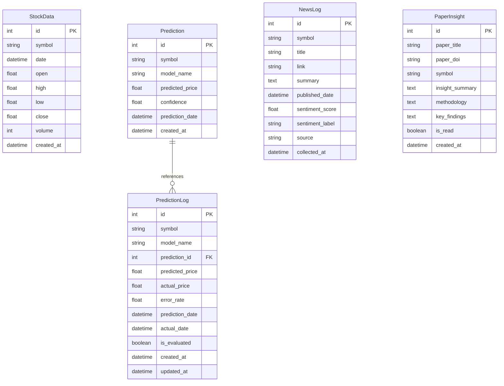

# Database Schema Diagram

## Entity Relationship Diagram (ERD)

## Table Descriptions

### StockData
시장 데이터를 저장하는 테이블입니다.
- **symbol**: 주식/암호화폐 심볼 (예: AAPL, BTC-USD)
- **date**: 거래일
- **open, high, low, close**: 시가, 고가, 저가, 종가
- **volume**: 거래량

### Prediction
AI 모델의 예측 결과를 저장하는 테이블입니다.
- **symbol**: 예측 대상 심볼
- **model_name**: 사용된 ML 모델 이름
- **predicted_price**: 예측된 가격
- **confidence**: 예측 신뢰도 (0-1)
- **prediction_date**: 예측 대상 날짜

### PredictionLog
예측 검증을 위한 로그 테이블입니다.
- **prediction_id**: Prediction 테이블 참조 (선택적)
- **predicted_price**: 예측 가격
- **actual_price**: 실제 시장 가격
- **error_rate**: 오차율 (|predicted - actual| / actual * 100)
- **is_evaluated**: 검증 완료 여부

### NewsLog
수집된 뉴스 기사를 저장하는 테이블입니다.
- **symbol**: 관련 심볼
- **title**: 뉴스 제목
- **link**: 뉴스 링크
- **summary**: 요약
- **sentiment_score**: 감성 점수 (-1: 악재, 1: 호재)
- **sentiment_label**: 감성 레이블 (positive/negative/neutral)
- **source**: 뉴스 출처 (rss, crawler 등)

### PaperInsight
연구 논문 기반 인사이트를 저장하는 테이블입니다.
- **paper_title**: 논문 제목
- **paper_doi**: 논문 DOI
- **symbol**: 관련 심볼
- **insight_summary**: 인사이트 요약
- **methodology**: 방법론
- **key_findings**: 주요 발견사항

## Relationships

- **Prediction → PredictionLog**: 하나의 예측(Prediction)은 여러 검증 로그(PredictionLog)를 가질 수 있습니다. (1:N, 선택적)
- 모든 테이블은 **symbol**을 통해 논리적으로 연결됩니다.

## Indexes

- `symbol` 필드는 대부분의 테이블에서 인덱싱되어 있어 빠른 조회가 가능합니다.
- Primary Key (`id`)는 자동으로 인덱싱됩니다.

