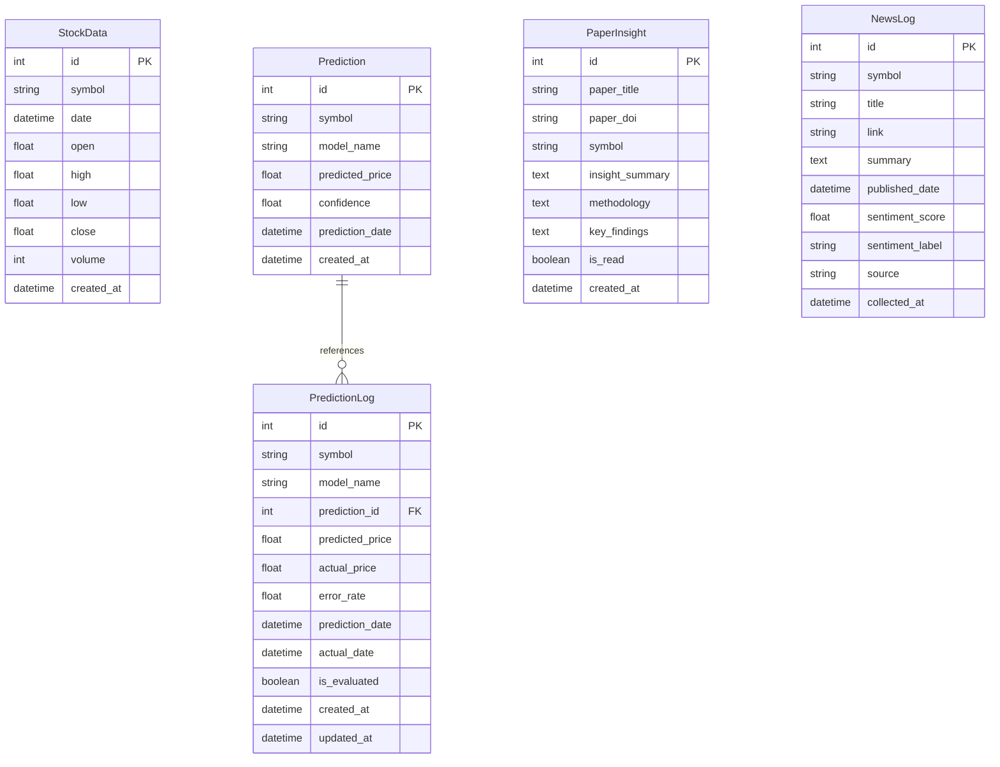

# Database Schema Diagram (Auto-generated)

> ⚠️ This file is auto-generated. Edit `scripts/generate_schema_diagram.py` to modify.

## Entity Relationship Diagram

```mermaid
erDiagram
    StockData {
        int id PK
        string symbol
        datetime date
        float open
        float high
        float low
        float close
        int volume
        datetime created_at
    }

    Prediction {
        int id PK
        string symbol
        string model_name
        float predicted_price
        float confidence
        datetime prediction_date
        datetime created_at
    }

    PaperInsight {
        int id PK
        string paper_title
        string paper_doi
        string symbol
        text insight_summary
        text methodology
        text key_findings
        boolean is_read
        datetime created_at
    }

    PredictionLog {
        int id PK
        string symbol
        string model_name
        int prediction_id FK
        float predicted_price
        float actual_price
        float error_rate
        datetime prediction_date
        datetime actual_date
        boolean is_evaluated
        datetime created_at
        datetime updated_at
    }

    NewsLog {
        int id PK
        string symbol
        string title
        string link
        text summary
        datetime published_date
        float sentiment_score
        string sentiment_label
        string source
        datetime collected_at
    }

    Prediction ||--o{ PredictionLog : "references"
```
